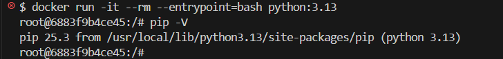
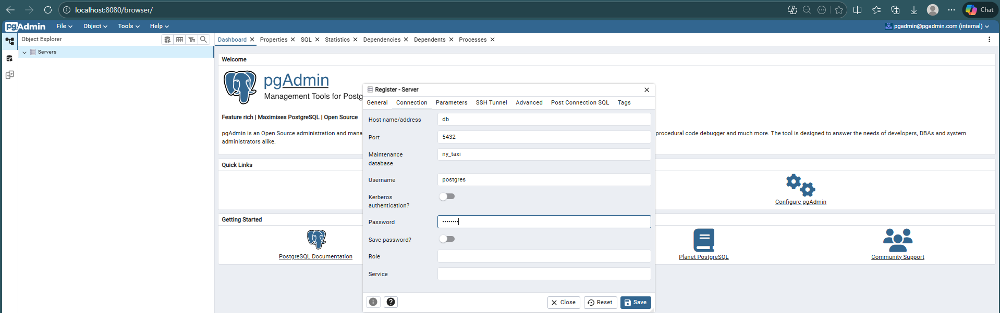

# Module 1 Homework: Docker & SQL

## Question 1. Understanding Docker images

Run docker with the `python:3.13` image. Use an entrypoint `bash` to interact with the container.

What's the version of `pip` in the image?

- 25.3
- 24.3.1
- 24.2.1
- 23.3.1

Answer: 25.3

type in terminal `docker run -it --rm --entrypoint=bash python:3.13`
and then inside the container, type `pip -V`



## Question 2. Understanding Docker networking and docker-compose

Given the following `docker-compose.yaml`, what is the `hostname` and `port` that pgadmin should use to connect to the postgres database?

```yaml
services:
  db:
    container_name: postgres
    image: postgres:17-alpine
    environment:
      POSTGRES_USER: 'postgres'
      POSTGRES_PASSWORD: 'postgres'
      POSTGRES_DB: 'ny_taxi'
    ports:
      - '5433:5432'
    volumes:
      - vol-pgdata:/var/lib/postgresql/data

  pgadmin:
    container_name: pgadmin
    image: dpage/pgadmin4:latest
    environment:
      PGADMIN_DEFAULT_EMAIL: "pgadmin@pgadmin.com"
      PGADMIN_DEFAULT_PASSWORD: "pgadmin"
    ports:
      - "8080:80"
    volumes:
      - vol-pgadmin_data:/var/lib/pgadmin

volumes:
  vol-pgdata:
    name: vol-pgdata
  vol-pgadmin_data:
    name: vol-pgadmin_data
```

- postgres:5433
- localhost:5432
- db:5433
- postgres:5432
- db:5432

If multiple answers are correct, select any 

Answer: postgres:5432 and db:5432 both are correct. Can manually spin the docker container up with `docker-compose up -d` and go to http://localhost:8080
and try the both configuration to connect pgadmin with postgres database. Login with email and password (Email: pgadmin@pgadmin.com Password: pgadmin).

Servers" > "Register" > "Server

| Tab | Field | Value |
| :--- | :--- | :--- |
| General | Name | ANY (eg: Postgres-Fazlan) |
| Connection | Host name/address | db (or postgres) |
| Connection | Port | 5432 |
| Connection | Maintenance database | ny_taxi |
| Connection | Username | postgres |
| Connection | Password | postgres |



## Prepare the Data

Download the green taxi trips data for November 2025:

```bash
wget https://d37ci6vzurychx.cloudfront.net/trip-data/green_tripdata_2025-11.parquet
```

You will also need the dataset with zones:

```bash
wget https://github.com/DataTalksClub/nyc-tlc-data/releases/download/misc/taxi_zone_lookup.csv
```

or if wget not install can use curl

```bash
curl -O https://d37ci6vzurychx.cloudfront.net/trip-data/green_tripdata_2025-11.parquet
```
```bash
curl -O https://github.com/DataTalksClub/nyc-tlc-data/releases/download/misc/taxi_zone_lookup.csv
```
After done create the pipeline, dockerfile and docker-compose

`docker-compose up -d pg-database pgadmin`

`docker-compose run ingest-pipeline \
    --pg-host pg-database \
    --year 2025 \
    --month 11 \
    --target-table green_taxi_2025_11
`

`docker-compose run ingest-pipeline \
    --url "https://github.com/DataTalksClub/nyc-tlc-data/releases/download/misc/taxi_zone_lookup.csv" \
    --target-table taxi_zone_lookup \
    --pg-host pg-database
`


For the trips in November 2025 (lpep_pickup_datetime between '2025-11-01' and '2025-12-01', exclusive of the upper bound), how many trips had a `trip_distance` of less than or equal to 1 mile?

- 7,853
- 8,007
- 8,254
- 8,421

Answe: 8007

`
SELECT COUNT(*)
FROM public."green_taxi_2025_11"
WHERE "trip_distance" <= 1.0
AND "lpep_pickup_datetime" >= '2025-11-01' 
AND "lpep_pickup_datetime" < '2025-12-01'
`


## Question 4. Longest trip for each day

Which was the pick up day with the longest trip distance? Only consider trips with `trip_distance` less than 100 miles (to exclude data errors).

Use the pick up time for your calculations.

- 2025-11-14
- 2025-11-20
- 2025-11-23
- 2025-11-25

Answer : 2025-11-14  

`
SELECT CAST(lpep_dropoff_datetime AS DATE) AS dropoff_date, MAX(trip_distance) AS max_trip_dist
FROM public.green_taxi_2025_11
WHERE "trip_distance" < 100.0
GROUP BY dropoff_date
ORDER BY max_trip_dist DESC
limit 1
`

## Question 5. Biggest pickup zone

Which was the pickup zone with the largest `total_amount` (sum of all trips) on November 18th, 2025?

- East Harlem North
- East Harlem South
- Morningside Heights
- Forest Hills

Answer : East Harlem North 

`SELECT z."Zone", SUM(g."total_amount")
FROM public.green_taxi_2025_11 g
INNER JOIN taxi_zone_lookup z
ON g."PULocationID" = z."LocationID"
GROUP BY z."Zone"
ORDER BY SUM(g."total_amount") DESC
LIMIT 1
`

## Question 6. Largest tip

For the passengers picked up in the zone named "East Harlem North" in November 2025, which was the drop off zone that had the largest tip?

Note: it's `tip` , not `trip`. We need the name of the zone, not the ID.

- JFK Airport
- Yorkville West
- East Harlem North
- LaGuardia Airport

Answer: Yorkville West 
`
SELECT zdo."Zone", MAX(g."tip_amount")
FROM green_taxi_2025_11 g
INNER JOIN taxi_zone_lookup zpu
ON g."PULocationID" = zpu."LocationID"
INNER JOIN taxi_zone_lookup zdo
ON g."DOLocationID" = zdo."LocationID"
WHERE zpu."Zone" = 'East Harlem North'
AND g."lpep_pickup_datetime" between '2025-11-01' and '2025-12-01'
GROUP BY zdo."Zone"
ORDER BY MAX(g."tip_amount") DESC
LIMIT 1
`

## Terraform

In this section homework we'll prepare the environment by creating resources in GCP with Terraform.

In your VM on GCP/Laptop/GitHub Codespace install Terraform.
Copy the files from the course repo
[here](../../../01-docker-terraform/terraform/terraform) to your VM/Laptop/GitHub Codespace.

Modify the files as necessary to create a GCP Bucket and Big Query Dataset.


## Question 7. Terraform Workflow

Which of the following sequences, respectively, describes the workflow for:
1. Downloading the provider plugins and setting up backend,
2. Generating proposed changes and auto-executing the plan
3. Remove all resources managed by terraform`

Answers:
- terraform import, terraform apply -y, terraform destroy
- teraform init, terraform plan -auto-apply, terraform rm
- terraform init, terraform run -auto-approve, terraform destroy
- terraform init, terraform apply -auto-approve, terraform destroy
- terraform import, terraform apply -y, terraform rm

Answer: terraform init, terraform apply -auto-approve, terraform destroy
